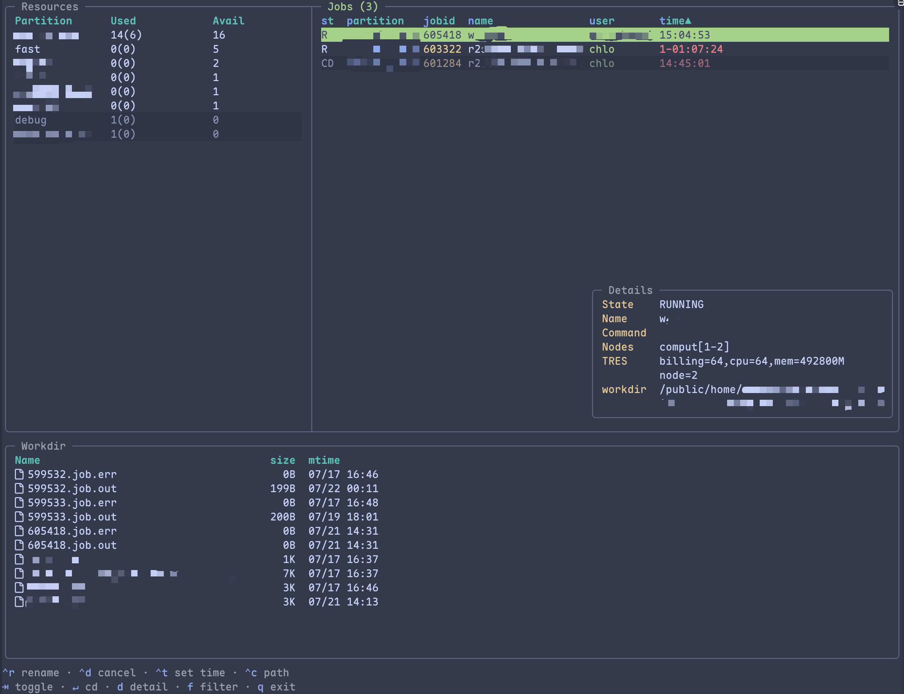

# turm

[](https://pypi.python.org/pypi/turm)
[](https://crates.io/crates/turm)
[](https://anaconda.org/conda-forge/turm)

A TUI for [Slurm](https://slurm.schedmd.com/), which provides a convenient way to manage your cluster jobs.

This repository is a fork of [karimknaebel/turm](https://github.com/karimknaebel/turm).



`turm` displays active jobs and jobs recorded by Slurm during the previous two days. Use `turm --help` to see the available filters. For example, to show only your own jobs, including completed and failed jobs:
```shell
turm --me --states=ALL
```

## Installation

`turm` is available on [PyPI](https://pypi.org/project/turm/), [crates.io](https://crates.io/crates/turm), and [conda-forge](https://github.com/conda-forge/turm-feedstock):

```shell
# With uv.
uv tool install turm

# With pip.
pip install turm

# With cargo.
cargo install turm

# With pixi.
pixi global install turm

# With conda.
conda install --channel conda-forge turm

# With wget. Make sure ~/.local/bin is in your $PATH.
wget https://github.com/hheei/turm/releases/latest/download/turm-x86_64-unknown-linux-musl.tar.gz -O - | tar -xz -C ~/.local/bin/
```

The [release page](https://github.com/hheei/turm/releases) also contains precompiled binaries for Linux.

### Shell Completion (optional)

#### Bash

In your `.bashrc`, add the following line:
```bash
eval "$(turm completion bash)"
```

#### Zsh

In your `.zshrc`, add the following line:
```zsh
eval "$(turm completion zsh)"
```

#### Fish

In your `config.fish` or in a separate `completions/turm.fish` file, add the following line:
```fish
turm completion fish | source
```

### Change directory on exit (Zsh)

Like Yazi, `turm` can write the selected directory to a temporary file so a
shell function can change the current shell's directory. Add this to `.zshrc`:

The `sq` wrapper starts `turm` and changes the calling shell to the directory
selected in the Workdir panel when `turm` exits. Use `sq` instead of `turm` for
quick directory jumping, for example `sq --me`.

```zsh
unalias sq 2>/dev/null
sq() {
    local tmp cwd rc
    tmp="$(mktemp -t turm-cwd.XXXXXX)" || return
    command turm "$@" --cwd-file="$tmp"
    rc=$?
    cwd="$(<"$tmp")"
    [[ -n "$cwd" && "$cwd" != "$PWD" ]] && builtin cd -- "$cwd"
    command rm -f -- "$tmp"
    return $rc
}
```

## How it works

`turm` obtains information about jobs by parsing a single `sacct` query. The query includes allocation records active during the previous two days, so pending, running, completed, failed, and cancelled jobs can share one list. Accounting updates can take a few seconds to appear after a job is submitted.

### Resource usage

TL;DR: `turm` ≈ `watch -n2 sacct` + `tail -f slurm-log.out`

Special care has been taken to ensure that `turm` is as lightweight as possible in terms of its impact on the Slurm controller and its file I/O operations.
The job list is updated every two seconds by running `sacct`. By default, active jobs are limited to the current account while historical jobs are limited to the current user; `--me`, `--user`, and `--account` provide explicit scopes.
`turm` updates the currently displayed log file on every inotify modify notification, and it only reads the newly appended lines after the initial read.
However, since inotify notifications are not supported for remote file systems, such as NFS, `turm` also polls the file for newly appended bytes every two seconds.

## Development without Slurm

For local UI testing, this repository includes mocks for `sacct`, `scancel`, and `scontrol`:

```shell
PATH=scripts/mock-slurm/bin:$PATH cargo run -- --me
```

The mock commands read/write files in `scripts/mock-slurm/logs`, so you can test log rendering and control actions without a Slurm install.

## Star History

[](https://www.star-history.com/#karimknaebel/turm&Date)
